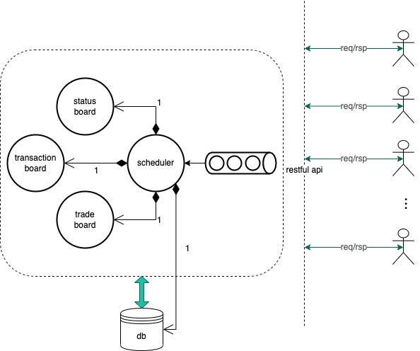
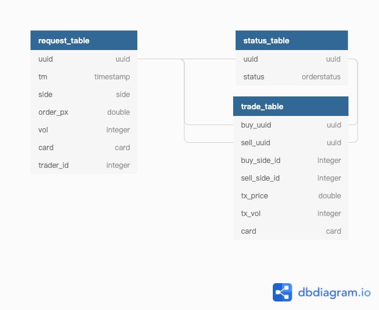
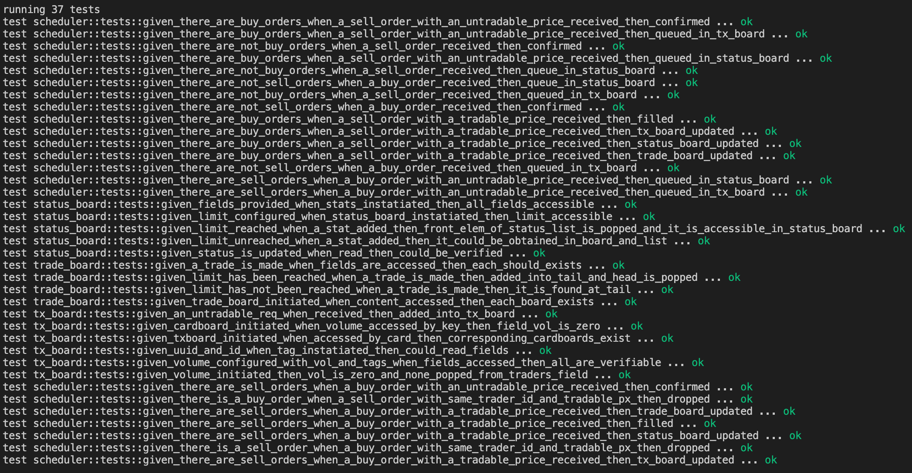
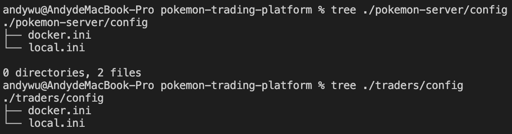
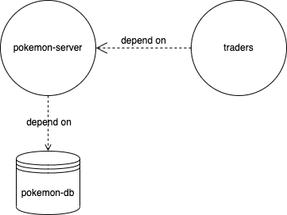
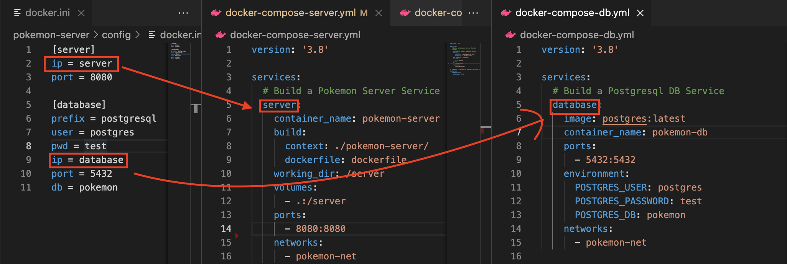
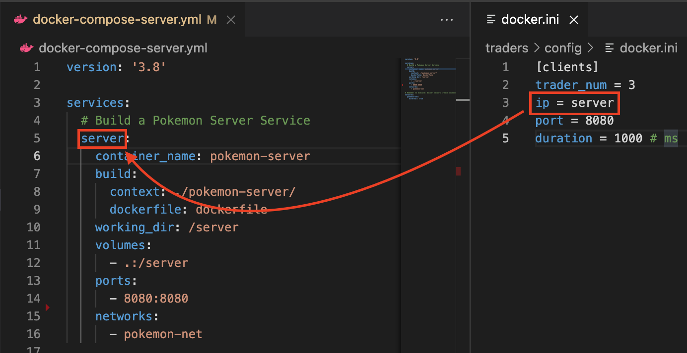

# Introduction

The side project is essentially an interview assignment from [FST network](https://www.twincn.com/item.aspx?no=50763592). It aims to craft a simple pokemon-card trading platform for those who would like to buy/sell their own cards and query transaction status.

Different from other interviewees, I decided to complete the project in [Rust](https://www.rust-lang.org/). The corresponding tests, containerization, api specifications and db schemas are involved in the following sections. 

# Prerequisites

Remember to be ready with the following requirements if you would like to run the project on your machine as well as on docker containers.

- [Rust Toolchain](https://www.rust-lang.org/learn/get-started)
- [Docker Desktop](https://www.docker.com/get-started)
- [Postgres Database 14.1](https://www.postgresql.org/download/)

# Restful API Specifications
POST /api/pokemon/card - buy/sell a card

GET /api/pokemon/trade/:card - view the latest 50 trades on each kind of card

GET /api/pokemon/order/:id - view the status of latest 50 orders of a specific trader

GET /api/pokemon/trade/history?id=:id&date=:date - view the trade history of a specific trader on a specified date

GET /api/pokemon/request/history?id=:id&date=:date - view the request history of a specific trader on a specified date

GET /api/pokemon/order/status?uuid=:uuid - view the status a specific order with unique identifier

# Trading Scenario

As pokemon triggers people's interest in collecting special species in virtual world, we are going to craft another application for those who like gathering pokemon cards to look back to the past time competing with peers for particular cards. 

To make it simply prototyped in the beginning, we restrict the cards within 4 types: Pikachu, Bulbasaur, Charmander and Squirtle. And players could make deals with others as each card's price ranges from 1.00 USD to 10.00 USD; A player can only buy/sell 1 card per order at one time. Ideally, your trading platform should tolerate up to 10K daily active users with graceful shutdown handling when unexpected crashes occur.

Any player's comsumption right is protected so that when the sequence of orders is fixed, the results must be the same no matter how many times you execute the sequence. The most important is that self-trade must be disallowed and would be blocked as detected by the system.

Supposed that ```B``` represents a bid-price of an order while ```S``` represents an ask-price, a transaction happens when:

- [```BID```] S <= B && S is the lowest one among all ask orders, transaction price is at ```S```
- [```ASK```] S <= B && B is the highest one among all bid orders, transaction price is at ```B```

In conclusion, the transaction rules are as follows:

1. card ∈ { Pikachu, Bulbasaur, Charmander, Squirtle }
2. card price ∈ [1.00 , 10.00 ] USD
3. total 10K users
4. A player can only buy/sell 1 card per order at one time
5. Order Processing: FIFO
6. Tx occurs when (```B```: price of an bid-order, ```S```: price of an ask-order)
    - [```BID```] S <= B && S is the lowest one among all ask-orders, transaction price is at ```S```
    - [```ASK```] S <= B && B is the highest one among all bid-orders, transaction price is at ```B```
7. Self-trade is disallowed

# Logical Architecture

<p align="center">
  
</p>

From the [previous section](#trading-scenario), we could simulate several roles of the trading scenario into the object relationships. First of all, traders send [various requests](#restful-api-specifications) to the server. In order for the synchronization issue, I adopted an order queue ensuring requests are processed orderly. As you see, there is a scheduler consists of different components stated as the table below.

| Component    | Responsibility                                      |
|:--------------|:-----------------------------------------------------|
| order_queue  | synchronize requests from traders                   |
| tx_board     | record realtime price/volume transactions of traders |
| status_board | record status of orders                             |
| trade_board  | record status of filled transactions                |
| db           | store transaction information                       |

When a POST request is received, the scheduler would match the order with non-filled ones and update other 3 boards. On the other hand, tx_board, status_board and trade_board are essentially in-memory states in prevent the datastore from being frequently accessed. The database is accessed when either a client is going to query historic data or a request is processed so relevant tables are updated.

By the way, there is an implicit **recover** function in the scheduler implemented for recovering realtime transaction data when the system crashes abruptly, so clients need not worry about whether their orders abort due to unexpected errors.
```rust
/**
* Recover the untraded, realtime prices/volumes for tx_board
* The function is adopted when the program crashes suddenly
* and needs disaster recovering in no time
**/
pub  fn  recover(&mut  self){...}
```

# DB Schema
<p align="center">
  
</p>

|Table Name|request_table|status_table|trade_table|
|-|-|-|-|
|**Usage**|The table records whole requests from traders, which is updated when an order comes in.|The table stores the latest order status with corresponding uuid. Once status of an order is updated, so is the table.|The table contains records of filled orders. That is to say, when buy-side and sell-side have traded with each other, the table is updated as well.

Let's dig deeper into the columns of each table. The thing you should bear in mind is that all tables are correlated with specific `uuid`, which is n unique identifier of an order, so that you could query state of an order with it .

First of all, let's investigate columns of table `request_table`
|Column|uuid|tm|side|order_px|vol|card|trader_id|
|:-|-|-|-|-|-|-|-|
|**Type**|uuid|timestamp|side (enum)|double|integer|card|integer|
|**Description**|unique id of an order|order time|Buy/Sell|order price|order volume|card type|unique trader-specific id|

Secondly, `status_table` records status of orders when an order is confirmed or filled in matching process.
|Column|uuid|status|
|:-|-|-|
|**Type**|uuid|orderstatus (enum)|
|**Description**|unique id of an order|Confirmed/Filled|

Lastly, we adopt a `trade_table` to store all *traded transactions* for further history queries.
|Column|buy_uuid|sell_uuid|buy_side_id|sell_side_id|tx_price|tx_vol|card|
|:-|-|-|-|-|-|-|-|
|**Type**|uuid|uuid|integer|integer|double|integer|card (enum)|
|**Description**|unique id of buy-side user|unique id of sell-side user|buy-side trader id|sell-side trader id|traded price|traded quantity|Pikachu/Bulbasaur/Charmander/Squirtle|

# Unit Tests Report
Quality assurance are provided by basic unit tests on core modules to cover sufficient code coverage. In the side project, I am used to adopting the form as below to edit my test cases so that anyone could trace my use cases with ease. 
```
given_{ conditions }_when_{ action }_then_{ result }
```
If you would like to run unit test on the server-side workspace, type command as follows:
```sh
cargo test
```
And the corresponsive report is generated.


# Local Configuration
When you first time clone the project into your workspace, the file [Cargo.toml](./Cargo.toml) indicates there are 2 sub-projects in the directory: ```pokemon-server``` and ```traders```.
```toml
[workspace]
members=["pokemon-server", "traders"]
```
```pokemon-server``` plays an important role of providing services to those who feel like exchanging pokemon cards with one another; ```traders``` launches as many clients as we want to simulate the trading behavior in the real world. For each sub-project, there is a configuration directory stating 2 different activation patterns:


For local-site activation, we refer to ```local.ini``` on both server-side and client-side applications. First of all, let's investigate the [server-side configuration file](./pokemon-server/config/local.ini):
```ini
[server]
ip = localhost
port = 8080

[database]
prefix = postgresql
user = postgres
pwd = test
ip = localhost
port = 5432
db = pokemon
```
Remember that a ```postgresql database``` is required if you don't adopt a docker container to generate a database image. Back to [Prerequisites](#prerequisites) for futher installation and set up create a database as above. The parameters are ready for the server application to read.

On the other hand, the client-side application has to determine how many players are going to be generated sending requests to the pokemon trading platform. Referring to the [client-side configuration file](./traders/config/local.ini), we could set field ```trader_num``` to decide how many clients are going to paarticipate in the pokemon trading scenario.
```ini
[clients]
trader_num = 5
ip = localhost
port = 8080
duration = 1000 # ms
```
By the way, the field ```duration``` points out the periodic cycle at which a request is sent for each client. Feel free to adjust the value as you want.

# Run on Local Host
To launch the ```pokemon-server```, follow the command as below when your configuration has been ready.
```sh
cargo run --bin pokemon-server ./pokemon-server/config/local.ini
```
To launch the ```trader```, follow the command as below when your configuration has been ready.
```sh
cargo run --bin traders ./traders/config/local.ini
```

# API Tests in Linux Command

curl localhost:8080/api/pokemon/card -X POST -H "Content-type:application/json" -d @test-script/post.json

curl -X GET localhost:8080/api/pokemon/trade/:card

curl -X GET localhost:8080/api/pokemon/order/:id

# Docker Configuration
<p align="center">
  
</p>

The above figure shows docker containers' dependency based on the execution order. ```pokemon-db``` represents a postgresql database handling data storing tasks. And then the ```pokemon-server``` is launched to serve clients spawned from ```traders```. Remember to consult the [Prerequisites](#prerequisites) section for installing associative tools to view containers' status.

Activate corresponding containers in order: ```pokemon-db``` -> ```pokemon-server``` -> ```traders```

There are 3 docker-compose files in the root directory: [```docker-compose-db.yml```](./docker-compose-db.yml), [```docker-compose-server.yml```](./docker-compose-server.yml), and [```docker-compose-clients.yml```](./docker-compose-clients.yml), each of which contains the necessary configuration to enable the communication among these containers.

### [1]  [```docker-compose-db.yml```](./docker-compose-db.yml)
Let's investigate [```docker-compose-db.yml```](./docker-compose-db.yml), I read the [Postgres - Docker Hub](https://hub.docker.com/_/postgres) to edit the database container's configuration. Note that for ```ports``` field, I mapped port: 5432 in the container to the port: 5432 on the docker host. And ```environment``` variables abide by what I had set up in [local configuration](#local-configuration).
```yml
services:
  # Build a Postgresql DB Service
  database:
    image: postgres:latest
    container_name: pokemon-db
    ports:
      - 5432:5432
    environment:
      POSTGRES_USER: postgres
      POSTGRES_PASSWORD: test
      POSTGRES_DB: pokemon
    networks:
      - pokemon-net
```

### [2] [```docker-compose-server.yml```](./docker-compose-server.yml)
No matter from the logical architecture or from the containers' relationships, ```pokemon-server``` depends on the service provided by ```pokemon-db```. Note that ```build``` field indicates where the context operates and which file it uses. Here it executes the [dockerfile](./pokemon-server/dockerfile) to simulate the server beahvior in the created container.

```yml
services:
  # Build a Pokemon Server Service
  server:
    container_name: pokemon-server
    build: 
      context: ./pokemon-server/
      dockerfile: dockerfile
    working_dir: /server
    volumes:
      - .:/server
    ports:
      - 8080:8080
    networks:
      - pokemon-net
      
# Remeber to execute: docker network create pokemon-net
networks:
  pokemon-net:
    external: true
```

### [3] [```docker-compose-clients.yml```](./docker-compose-clients.yml)
Lastly, let's survey the simplest one. When ```pokemon-db``` and ```pokemon-server``` are prepared, the ```clients``` could be launched to generate as many clients as they want to exchange their own cards on the platform. Identically, its ```build``` fields refers to the context it operates on as welll as the [file](./traders/dockerfile) it is going to execute.

```yml
services:
  # Build traders
  clients:
    container_name: traders
    build:
      context: ./traders/
      dockerfile: dockerfile
    networks:
      - pokemon-net
      
# Remeber to execute: docker network create pokemon-net
networks:
  pokemon-net:
    external: true
```

[4] [docker.ini](./pokemon-server/dockerfile) of ```pokemon-server```
<p align="center">
  
</p>

Note that there are some difference between docker's and local's configuration. In a docker container, we want to communiate with a virtual host, so that ip fields are replaced with services' names and are automatically resolved.

[5] [docker.ini](./traders/dockerfile) of ```traders```
<p align="center">
  
</p>

Also, the ```traders``` container's clients need to resolve ```server``` ip within a container.

# Run on Docker Containers
Before launching any container, we should know that each one is an independent object. If we want to bridge the network communication among them, ```network``` attribute needs to be configured. Anyone could go through the [Networking Overview](https://docs.docker.com/network/) for futher information.
```yml
networks:
  pokemon-net:
    external: true
```
### [1] Create a Network Bridge
Note that we all have seen the common attribute among all *.yml files. And these 3 containers are going to communicate through the bridged network ```pokemon-net```. Therefore we have to create the network beforehand, so that these containers are assured to link together.
```docker
docker network create pokemon-net
```
And check whether the network has been created by
```docker
docker network ls
```
### [2] Enable a ```pokemon-db``` Container
We have explained the content of [database](./docker-compose-db.yml) .yml file, so that a database container could be enabled by the command as below:
```docker
docker-compose -f docker-compose-db.yml up
```
For more information of docker-compose, please refer to [this](https://docs.docker.com/compose/).
### [3] Enable a ```pokemon-server``` Container
After a database container has been enabled, we are going to activate the ```pokemon-server``` container.
```docker
docker-compose -f docker-compose-server.yml up
```

### [4] Enable a ```traders``` Container
Finally, launch a ```traders``` container to spawn as many client as you want to interact.
```docker
docker-compose -f docker-compose-clients.yml up
```

# Todo List
- [x] Restful API
- [x] Relational database (PostgreSQL, MySQL, ...)
- [x] Containerize (Docker & Docker Compose) 
- [x] Graceful shutdown (server & client)
- [x] Testing
- [x] Multithreading
- [ ] OpenAPI (Swagger)
- [x] Set up configurations using environment variables
- [x] Refactoring
- [] Readme 
- [x] Optimize docker activation speed